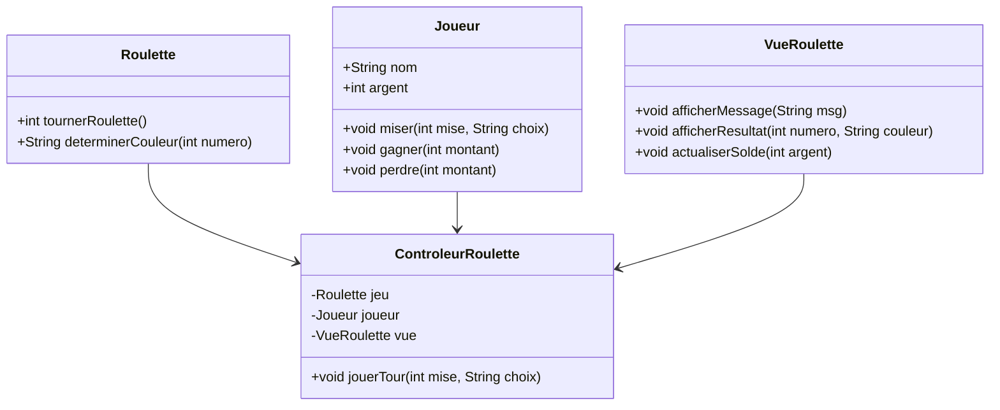
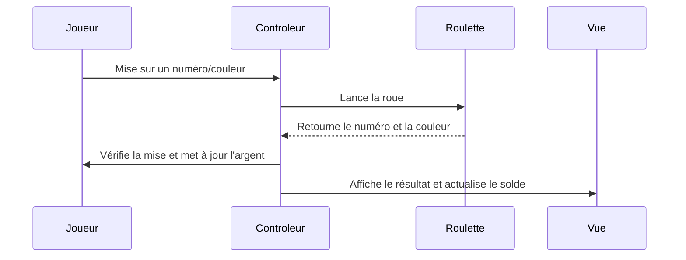

# Roulette

## Description
La roulette est un jeu de hasard où les joueurs misent sur un numéro, une couleur ou un groupe de numéros avant que la roue ne soit tournée. Une bille est ensuite lancée et s'arrête sur une case, déterminant les gagnants et les perdants.

## Règles du jeu
1. Le joueur commence avec une somme d'argent initiale.
2. Il peut placer différents types de mises :
    - **Numéro plein** (mise sur un seul numéro, paiement 35:1)
    - **Pair / Impair** (mise sur un nombre pair ou impair, paiement 1:1)
    - **Rouge / Noir** (mise sur la couleur, paiement 1:1)
    - **Douzaine** (mise sur un groupe de 12 numéros, paiement 2:1)
    - **Colonne** (mise sur une colonne entière, paiement 2:1)
    - **Manque (1-18) / Passe (19-36)** (mise sur une moitié du plateau, paiement 1:1)
3. Le joueur lance la roulette et un numéro est tiré au hasard.
4. Si le numéro correspond à la mise, le joueur reçoit ses gains selon les règles du jeu, sinon il perd sa mise.
5. Le jeu continue tant que le joueur a de l'argent.

## Implémentation en Java avec MVC
- **Modèle (`Roulette.java`)** : Gère la logique du jeu, le tirage aléatoire et le calcul des gains.
- **Vue (`RouletteGUI.java`)** : Interface graphique affichant la roue, les mises et le solde du joueur.
- **Contrôleur (`RouletteController.java`)** : Gère les interactions entre la vue et le modèle.

## Diagramme de classes

## Diagramme de séquence

## Étapes de développement
1. Créer la classe `Roulette` pour gérer les règles du jeu et les mises.
2. Développer une interface graphique avec des boutons et des champs pour placer des mises.
3. Relier la vue et le modèle à l'aide du contrôleur.
4. Ajouter une mise à jour en temps réel du solde et du résultat des tirages.
5. Améliorer l'affichage de la roue et intégrer des animations.

## Améliorations possibles
- Ajouter des effets visuels lors du tirage.
- Permettre au joueur d'enregistrer son score.
- Implémenter un mode multijoueur.
- Simuler des stratégies de mise (Martingale, Fibonacci, etc.).
- Ajouter un historique des tours précédents.